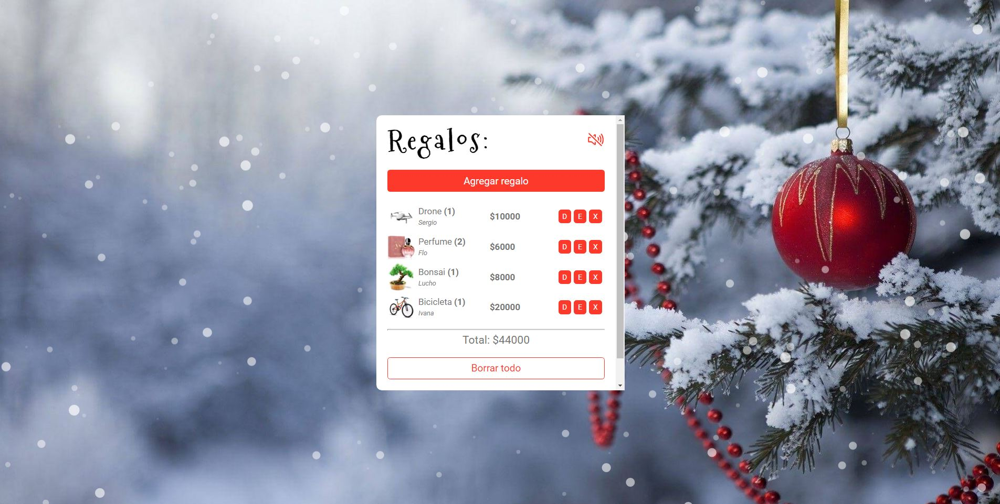

# 🎅 ADVIENCY APP! 🎄

[Challenge](https://twitter.com/goncy/status/1466050967808401409) propuesto por Goncy!

- Realizado con create-react-app y usando styled-components, howler.js, react-particles y react-to-print.

- La idea de la app es poder agregar regalos, editarlos, duplicarlos y borrarlos (uno por uno o todos a la vez).

- Posee un boton de "Sorpréndeme" para obtener un regalo al azar y un total donde se ve reflejado el precio de todos los regalos.

- Tambien posee un boton para imprimir dicha lista de regalos y otro para activar o desactivar el audio de la app.

- Los datos persisten gracias al uso del localStorage.

- Diseño responsive.

## Preview

